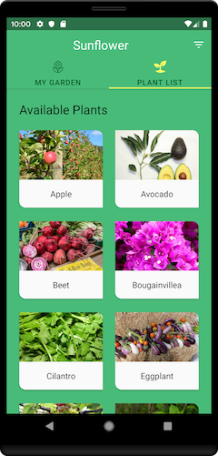
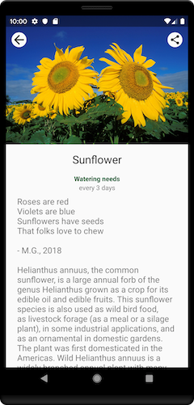

CircleCI Demo Android
=================
Demo for CI/CD pipeline for Android Native app using CircleCI.
Forked from [Sunflower App](https://github.com/android/sunflower).
You can see [config file here](https://github.com/tadashi0713/circleci-demo-android/blob/master/.circleci/config.yml).

* Use [Android Orb](https://circleci.com/developer/ja/orbs/orb/circleci/android) to 
  * Set [Android Machine Executor](https://circleci.com/docs/2.0/android-machine-image/)
  * Run Espresso tests with Android Emulator easily
  * Save & restore Gradle cache easily
* Use [Ruby Orb](https://circleci.com/developer/ja/orbs/orb/circleci/ruby) to install Fastlane with cache easily.
  * Fastlane is used to upload app to [Firebase App Distribution](https://firebase.google.com/docs/app-distribution)
* [Custom resource class](https://circleci.com/docs/ja/2.0/configuration-reference/#resourceclass) to optimise build speed
  * You can see how much resource(CPU and RAM) is used in each jobs in UI page(Available Docker Executors)


* [Running Unit Tests Parallel](https://circleci.com/docs/2.0/parallelism-faster-jobs/)


* Use [Context](https://circleci.com/docs/2.0/contexts/) for storing secrets(this time token for Firebase) for across projects.
* Upload test results & visualize in [Test Insights](https://circleci.com/docs/2.0/insights-tests/).

Getting Started
---------------
This project uses the Gradle build system. To build this project, use the
`gradlew build` command or use "Import Project" in Android Studio.

There are two Gradle tasks for testing the project:
* `connectedAndroidTest` - for running Espresso on a connected device
* `test` - for running unit tests

### Unsplash API key

Sunflower uses the [Unsplash API](https://unsplash.com/developers) to load pictures on the gallery
screen. To use the API, you will need to obtain a free developer API key. See the
[Unsplash API Documentation](https://unsplash.com/documentation) for instructions.

Once you have the key, add this line to the `gradle.properties` file, either in your user home
directory (usually `~/.gradle/gradle.properties` on Linux and Mac) or in the project's root folder:

```
unsplash_access_key=<your Unsplash access key>
```

The app is still usable without an API key, though you won't be able to navigate to the gallery screen.

Screenshots
-----------





Libraries Used
--------------
* [Foundation][0] - Components for core system capabilities, Kotlin extensions and support for
  multidex and automated testing.
  * [AppCompat][1] - Degrade gracefully on older versions of Android.
  * [Android KTX][2] - Write more concise, idiomatic Kotlin code.
  * [Test][4] - An Android testing framework for unit and runtime UI tests.
* [Architecture][10] - A collection of libraries that help you design robust, testable, and
  maintainable apps. Start with classes for managing your UI component lifecycle and handling data
  persistence.
  * [Data Binding][11] - Declaratively bind observable data to UI elements.
  * [Lifecycles][12] - Create a UI that automatically responds to lifecycle events.
  * [LiveData][13] - Build data objects that notify views when the underlying database changes.
  * [Navigation][14] - Handle everything needed for in-app navigation.
  * [Room][16] - Access your app's SQLite database with in-app objects and compile-time checks.
  * [ViewModel][17] - Store UI-related data that isn't destroyed on app rotations. Easily schedule
     asynchronous tasks for optimal execution.
  * [WorkManager][18] - Manage your Android background jobs.
* [UI][30] - Details on why and how to use UI Components in your apps - together or separate
  * [Animations & Transitions][31] - Move widgets and transition between screens.
  * [Fragment][34] - A basic unit of composable UI.
  * [Layout][35] - Lay out widgets using different algorithms.
* Third party and miscellaneous libraries
  * [Glide][90] for image loading
  * [Hilt][92]: for [dependency injection][93]
  * [Kotlin Coroutines][91] for managing background threads with simplified code and reducing needs for callbacks

[0]: https://developer.android.com/jetpack/components
[1]: https://developer.android.com/topic/libraries/support-library/packages#v7-appcompat
[2]: https://developer.android.com/kotlin/ktx
[4]: https://developer.android.com/training/testing/
[10]: https://developer.android.com/jetpack/arch/
[11]: https://developer.android.com/topic/libraries/data-binding/
[12]: https://developer.android.com/topic/libraries/architecture/lifecycle
[13]: https://developer.android.com/topic/libraries/architecture/livedata
[14]: https://developer.android.com/topic/libraries/architecture/navigation/
[16]: https://developer.android.com/topic/libraries/architecture/room
[17]: https://developer.android.com/topic/libraries/architecture/viewmodel
[18]: https://developer.android.com/topic/libraries/architecture/workmanager
[30]: https://developer.android.com/guide/topics/ui
[31]: https://developer.android.com/training/animation/
[34]: https://developer.android.com/guide/components/fragments
[35]: https://developer.android.com/guide/topics/ui/declaring-layout
[90]: https://bumptech.github.io/glide/
[91]: https://kotlinlang.org/docs/reference/coroutines-overview.html
[92]: https://developer.android.com/training/dependency-injection/hilt-android
[93]: https://developer.android.com/training/dependency-injection
